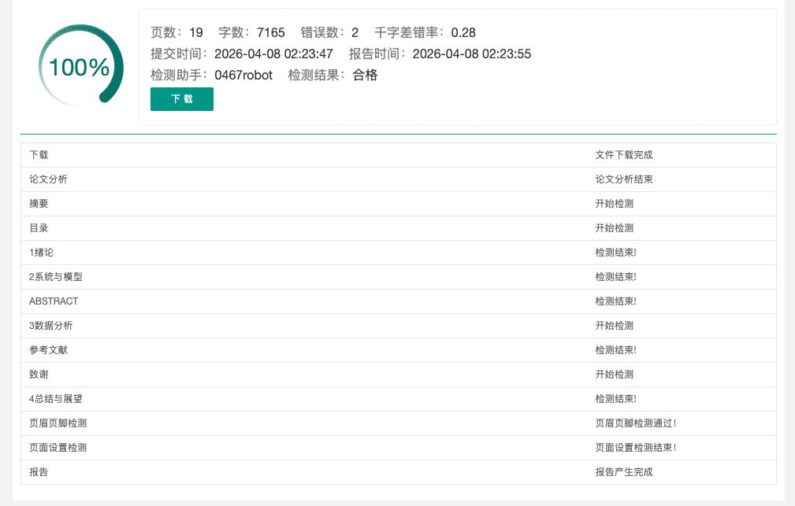

# 2026山东大学本科毕业论文（设计）模板-机电(低空)

本论文模板在 CTex环境下编译通过。

使用说明：直接下载此项目的 zip 文件并导入 Overleaf，在菜单中选择 XeLaTeX，TeX Live 版本选 2024 或 2025 即可。

本项目是基于[Shandong-University-Undergraduate-Thesis-Design-Template](https://github.com/KYRIE-LI11/Shandong-University-Undergraduate-Thesis-Design-Template)仓库修改适配的 2026 版山东大学本科毕业论文模板。

## 格式检测结果

下图为模板通过格式检测的合格截图：

### 联系

如果有任何疑问可以提issues
